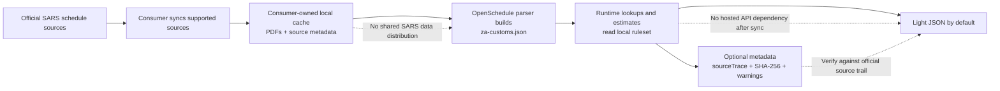

# OpenSchedule

OpenSchedule turns official statutory source documents into local, versioned, auditable rulesets. It is infrastructure for developers who need repeatable statutory data without depending on a hosted API, hidden parser state, or bundled third-party data.

The current consumer surface is South African customs from official SARS customs schedule sources.

## ZA Customs

`@openschedule/za-customs` builds and reads a managed local cache of SARS customs source documents and derived rulesets. It gives you:

- tariff-line lookup and available rate columns
- mechanically resolvable duty estimates
- source trace and source document references
- duties, trade remedies, rebates, drawbacks, and refunds across customs schedules
- light default responses, with parser/source metadata available only when requested

OpenSchedule does not publish or bundle SARS PDFs, SARS datasets, or shared generated customs rulesets. Consumers fetch supported official SARS sources into their own local cache, then build an auditable `za-customs.json` ruleset locally.

Why this shape:

- **Local runtime path:** after sync, lookups and mechanical estimates read the local `za-customs.json` ruleset instead of querying a hosted tariff API.
- **Auditable outputs:** `includeMetadata: true` and `source()` expose parser confidence, warnings, source trace, page locators, and source document SHA-256 hashes.
- **Typed contracts:** TypeScript types and JSON schemas cover tariff lines, rate components, duty estimates, source metadata, validation reports, and ruleset containers.



Examples below use synthetic tariff codes and values so the README does not copy official SARS tariff content.

## TypeScript

```bash
npm install @openschedule/za-customs
```

```ts
import { createZaCustoms } from "@openschedule/za-customs";

const customs = await createZaCustoms({ sync: "if-missing" });

const line = customs.lookup("000110");
const rates = customs.rates("000110");
const estimate = customs.estimate({
  tariffCode: "000110",
  customsValue: 1000,
  effectiveDate: "2026-07-05"
});

const fullLine = customs.lookup("000110", { includeMetadata: true });
const sourceRefs = customs.source("000110");
```

Sample light lookup response:

```json
{
  "tariffCode": "0001.10",
  "normalizedTariffCode": "000110",
  "description": "Synthetic goods",
  "displayName": "0001.10 Synthetic goods",
  "statisticalUnit": "kg",
  "rates": {
    "general": {
      "raw": "10%",
      "kind": "ad_valorem",
      "components": [{ "basis": "customs_value", "rate": 0.1 }]
    },
    "sadc": {
      "raw": "free",
      "kind": "free",
      "components": []
    }
  },
  "validFrom": "2026-07-01"
}
```

Sample estimate response:

```json
{
  "estimatedDuty": 100,
  "currency": "ZAR",
  "rulesetId": "ZA_SARS_CUSTOMS_ALL_SCHEDULES_SYNTHETIC",
  "tariffCode": "0001.10",
  "rateColumn": "general",
  "effectiveDate": "2026-07-05"
}
```

With `includeMetadata: true`, lookup responses also include source and parser context:

```json
{
  "tariffCode": "0001.10",
  "normalizedTariffCode": "000110",
  "description": "Synthetic goods",
  "metadata": {
    "confidence": 1,
    "warnings": ["fixture line warning"],
    "sourceTrace": [{
      "schemaVersion": "core.source-trace.v1",
      "sourceDocumentSha256": "0000000000000000000000000000000000000000000000000000000000000000",
      "page": 1,
      "locator": "synthetic fixture",
      "text": "0001.10 Synthetic goods"
    }],
    "sourceDocuments": [{
      "schemaVersion": "core.source-document-metadata.v1",
      "sha256": "0000000000000000000000000000000000000000000000000000000000000000",
      "fileName": "schedule.pdf",
      "sourceIdentifier": "ZA_SARS_CUSTOMS_SCHEDULE_1_PART_1"
    }]
  }
}
```

Available methods:

- `lookup(tariffCode)` returns one tariff line or `null`.
- `rates(tariffCode)` returns available rate columns for a line.
- `estimate({ tariffCode, customsValue, quantity, quantityUnit, rateColumn, effectiveDate })` returns a duty estimate. Unresolved rates return `estimatedDuty: null`.
- `source(tariffCode)` returns trace and source document references.
- `measures(filter)`, `duties(filter)`, and `reliefs(filter)` list paged customs measures.
- `sync({ mode })` refreshes the managed cache.

Common filters include `tariffCode`, `tariffPrefix`, `kind`, `schedule`, `item`, `code`, `origin`, `effectiveDate`, `limit`, and `cursor`.

## CLI

```bash
npm install -g @openschedule/cli
```

```bash
openschedule customs sync
openschedule customs lookup --tariff-code 000110
openschedule customs rates --tariff-code 000110 --include-metadata
openschedule customs estimate --tariff-code 000110 --customs-value 1000
openschedule customs measures --tariff-prefix 0307
openschedule customs duties --tariff-code 000110
openschedule customs reliefs --item 50102 --code 0104
openschedule customs source --tariff-code 000110
```

All consumer customs commands accept `--cache <dir>`, `--sync never|if-missing|if-stale|always`, and `--effective-date latest|YYYY-MM-DD` where relevant. Commands print JSON.

Legacy file-based parser commands still exist for internal workflows, but normal consumers should start with `openschedule customs ...`.

## MCP

Run the MCP server from `@openschedule/mcp`:

```bash
npm install -g @openschedule/mcp
openschedule-mcp
```

Consumer tools:

- `za_customs_sync`
- `za_customs_lookup`
- `za_customs_rates`
- `za_customs_estimate`
- `za_customs_source`
- `za_customs_measures`
- `za_customs_duties`
- `za_customs_reliefs`

These tools use the same parameters as the TypeScript API: `cacheDir`, `sync`, `effectiveDate`, `tariffCode`, `tariffPrefix`, `customsValue`, `quantity`, `quantityUnit`, `rateColumn`, `limit`, `cursor`, and `includeMetadata`.

## Metadata

Responses are light by default. Parser confidence, warnings, source trace, and source document metadata are omitted unless you pass `includeMetadata: true` or `--include-metadata`.

Use `source(tariffCode)`, `openschedule customs source`, or `za_customs_source` when you specifically need provenance.

## Sources And Cache

The managed cache stores fetched source documents, source metadata, and the generated `za-customs.json` ruleset. By default it lives under the platform cache directory, or under `OPENSCHEDULE_CACHE_DIR` when that environment variable is set. You can override it with `cacheDir` or `--cache`.

Sync modes:

- `never` reads the existing cache only.
- `if-missing` fetches missing sources.
- `if-stale` checks declared sources and fetches missing or changed sources.
- `always` refetches supported sources.

For production use, prefer `sync: "if-stale"` or an explicit `openschedule customs sync --sync if-stale` step in your own release process. The local ruleset manifest records source document hashes, source identifiers, retrieval metadata, parser package version, and warnings.

Source status checks are available when you need a freshness report:

```bash
openschedule status za-sars customs --cache <cache>
```

The command accepts either a managed cache root or its `sources` directory. MCP users can call `check_source_status` with the fetched-source cache directory.

OpenSchedule does not redistribute official SARS PDFs, official SARS datasets, or generated shared customs data. Users are responsible for verifying source-document rights, cache contents, and any legal reliance on generated outputs.

## Source Coverage

| Source family | Fetched | Parsed | Notes |
| --- | --- | --- | --- |
| Schedule 1 Part 1 ordinary customs duty | Yes | Yes | Tariff-line lookup, rate columns, estimates, and provenance. |
| Schedule 1 excise and levy parts | Yes | Yes | Row-bearing parts are parsed; notes-only PDFs are retained as sources. |
| Schedule 2 trade remedies | Yes | Yes | Anti-dumping, countervailing, and safeguard duty rows. |
| Schedules 3 to 6 reliefs | Yes | Yes | Rebates, drawbacks, refunds, and excise rebate/refund rows. |
| Tariff amendment registries | Declared | Manual review | HTML registry pages are tracked as source descriptors; notice-level parsing is not implemented yet. |

See [SARS customs source coverage](docs/za-sars-source-coverage.md) for the detailed source list and exclusions.

## Production Readiness And Legal Reliance

OpenSchedule is not a customs broker, classification engine, legal opinion, or hosted tariff API. It does not decide what goods are, whether a rebate applies to a transaction, or whether an official source has legal effect for your use case.

Duty estimates are mechanical calculations from resolvable rate text. Complex, conditional, missing, or ambiguous rates may return `estimatedDuty: null` with warnings in metadata.

## Development

```bash
npm run typecheck
npm test
git diff --check
```

The public package exports `@openschedule/za-customs`. Parser and ruleset internals are under `@openschedule/za-customs/internal` for CLI, MCP, tests, and maintenance work.
