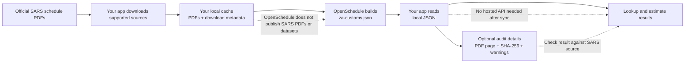

# @openschedule/za-customs

South African customs duty lookups and estimates for TypeScript apps.

`@openschedule/za-customs` downloads official SARS customs schedule PDFs into your cache, converts them into a local `za-customs.json` file, and lets your app look up tariff lines, rates, duty estimates, source references, duties, trade remedies, rebates, drawbacks, and refunds.

```bash
npm install @openschedule/za-customs
```

```ts
import { createZaCustoms } from "@openschedule/za-customs";

const customs = await createZaCustoms({ sync: "if-stale" });
const line = customs.lookup("000110", { includeMetadata: true });
const estimate = customs.estimate({
  tariffCode: "000110",
  customsValue: 1000,
  effectiveDate: "2026-07-05"
});
```

Sync modes are `never`, `if-missing`, `if-stale`, and `always`. Production apps should normally use `if-stale` in their own environment.

Why it works this way:

- **Runs locally after sync:** once `za-customs.json` exists, lookups and estimates do not need internet access or a hosted tariff API.
- **Easy to audit:** `includeMetadata: true` and `source()` show parser warnings, SARS PDF page references, and document hashes.
- **Typed for app developers:** TypeScript types and JSON schemas describe tariff lines, rates, estimates, source references, validation results, and the local data file.
- **Tested without copying SARS data:** `npm test` includes 50 synthetic duty examples covering ad valorem, specific, compound, preferential/free, and unresolved fallback cases.
- **Flags incomplete parses:** validation warns when a parse produced too few lines, reported parser warnings, or has mismatched counts.



OpenSchedule does not ship SARS PDFs, SARS datasets, or a prebuilt customs database. Examples use synthetic tariff codes to avoid copying official SARS tariff content.

OpenSchedule is not a customs broker, classification engine, legal opinion, or hosted tariff API. Verify legal reliance against official SARS sources.
