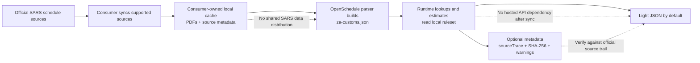

# @openschedule/za-customs

Consumer API and ruleset tooling for South African customs schedules.

`@openschedule/za-customs` fetches supported official SARS customs schedule PDFs into the consumer's local cache, builds a local `za-customs.json` ruleset, and exposes tariff lookup, rate options, mechanical duty estimates, source trace, duties, trade remedies, rebates, drawbacks, and refunds.

```bash
npm install @openschedule/za-customs
```

```ts
import { createZaCustoms } from "@openschedule/za-customs";

const customs = await createZaCustoms({ sync: "if-stale" });
const line = customs.lookup("000110", { includeMetadata: true });
const estimate = customs.estimate({
  tariffCode: "000110",
  customsValue: 1000,
  effectiveDate: "2026-07-05"
});
```

Sync modes are `never`, `if-missing`, `if-stale`, and `always`. Production consumers should normally use `if-stale` in their own environment.

Why this shape:

- **Local runtime path:** after sync, lookups and mechanical estimates read the local `za-customs.json` ruleset instead of querying a hosted tariff API.
- **Auditable outputs:** `includeMetadata: true` and `source()` expose parser confidence, warnings, source trace, page locators, and source document SHA-256 hashes.
- **Typed contracts:** TypeScript types and JSON schemas cover tariff lines, rate components, duty estimates, source metadata, validation reports, and ruleset containers.
- **Verification fixtures:** `npm test` includes 50 synthetic mechanical duty fixtures covering ad valorem, specific, compound, preferential/free, and unresolved fallback cases without republishing SARS tariff data.
- **Parser completeness gates:** ruleset validation surfaces low parsed-line counts, parser warnings, and metric mismatches so incomplete source parses are visible before production use.



OpenSchedule does not publish or bundle SARS PDFs, SARS datasets, or shared generated customs rulesets. Examples use synthetic tariff codes to avoid copying official SARS tariff content.

OpenSchedule is not a customs broker, classification engine, legal opinion, or hosted tariff API. Verify legal reliance against official SARS sources.
